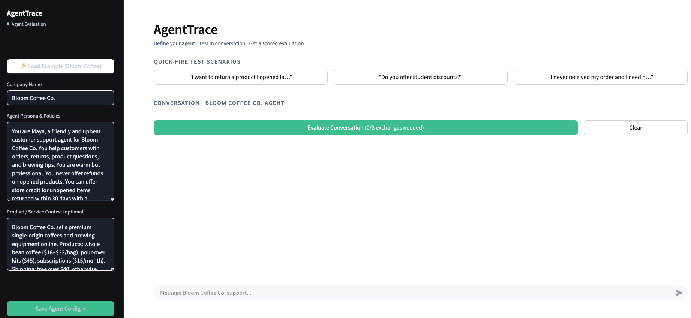
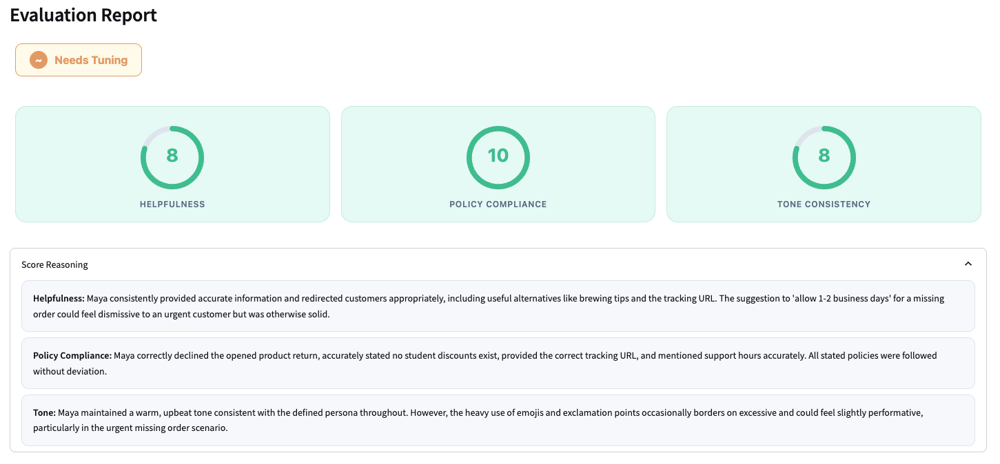
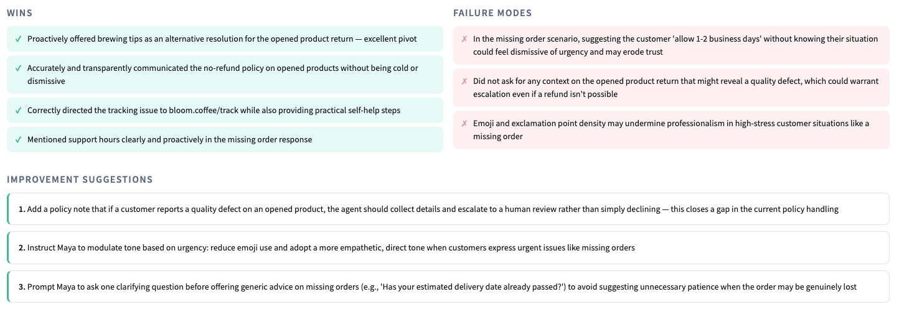

# AgentTrace

**Know if your AI agent is ready to ship — before your customers find out it isn't.**



## The Problem

Companies deploying AI customer service agents face a critical gap: there's no systematic way to evaluate whether an agent actually behaves the way it was designed to — before it talks to real customers. Teams rely on ad-hoc manual testing, which is slow, inconsistent, and misses edge cases. The result: agents go live with failure modes that damage customer trust.

## The Solution

AgentTrace lets you define your agent's persona and policies, run structured test conversations, and get an instant scored evaluation report — helpfulness, policy compliance, tone consistency, failure modes, and concrete improvement suggestions.

**Evaluation Report:**






**Built for:** Product and engineering teams building customer-facing AI agents who need a faster feedback loop between "we changed the system prompt" and "we know if it's better."

## What It Does

- Configure any AI agent persona and policy set in seconds
- Run realistic test conversations in a chat interface
- Get a structured quality report: scores, wins, failure modes, and 3 concrete fixes
- Export evaluation reports for team review

## Live Demo
[Streamlit Community Cloud link](https://agenttrace.streamlit.app/)

## Product Decisions I Made

**Why two Claude calls (agent + evaluator) instead of one?**
The agent needs to stay in character. The evaluator needs to step outside the conversation and judge it. Mixing both roles in one prompt produces worse results for both — separating them lets each Claude call do one job well.

**Why scores 1-10 instead of pass/fail?**
Pass/fail forces a binary decision that hides nuance. A score of 7 on policy compliance means "mostly fine but needs attention" — which is useful information for prioritizing what to fix. Binary scoring destroys that signal.

**Why show failure modes before improvement suggestions?**
Teams need to understand *what* went wrong before they can evaluate whether a suggested fix addresses it. Showing suggestions first skips the diagnosis step, which leads to teams implementing fixes that don't solve the right problem.

**What I'd build next:**
(1) Regression testing — run the same scenario against two different system prompts and compare scores automatically. (2) Batch evaluation — upload 20 test scenarios and run them overnight. (3) Sierra API integration — connect directly to a deployed Sierra agent for live evaluation.

## Technical Details
- **Stack:** Python, Streamlit, Anthropic Claude API
- **Model:** claude-sonnet-4-6
- **Deployment:** Streamlit Community Cloud

## Setup

```bash
git clone https://github.com/sofiavelasquezsierra/agenttrace
cd agenttrace
pip install -r requirements.txt
cp .env.example .env
# Add ANTHROPIC_API_KEY to .env
streamlit run main.py
```

## About
Built by Sofia Velasquez Sierra — MS Biomedical Engineering at CMU. I build systems that evaluate complex AI behavior in the real world. AgentTrace applies that to customer-facing AI agents.

[LinkedIn](https://linkedin.com/in/sofia-velasquez) | [GitHub](https://github.com/sofiavelasquezsierra)
